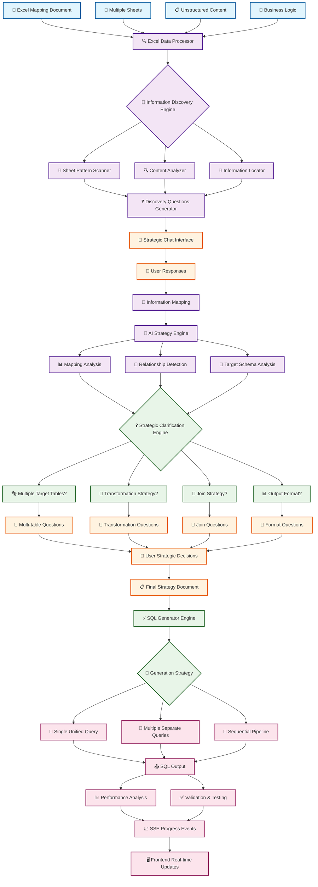
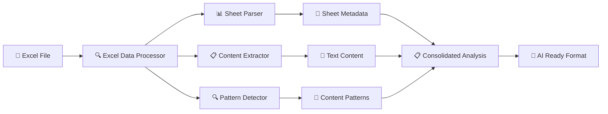
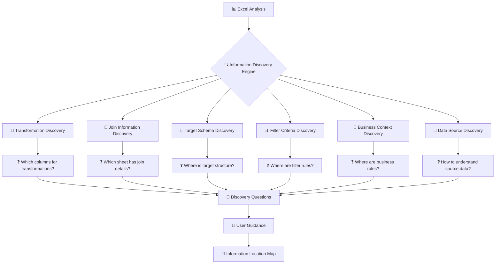
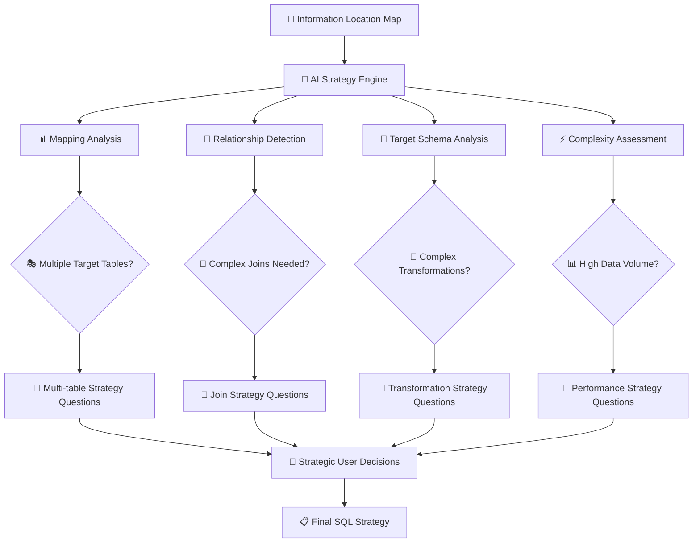
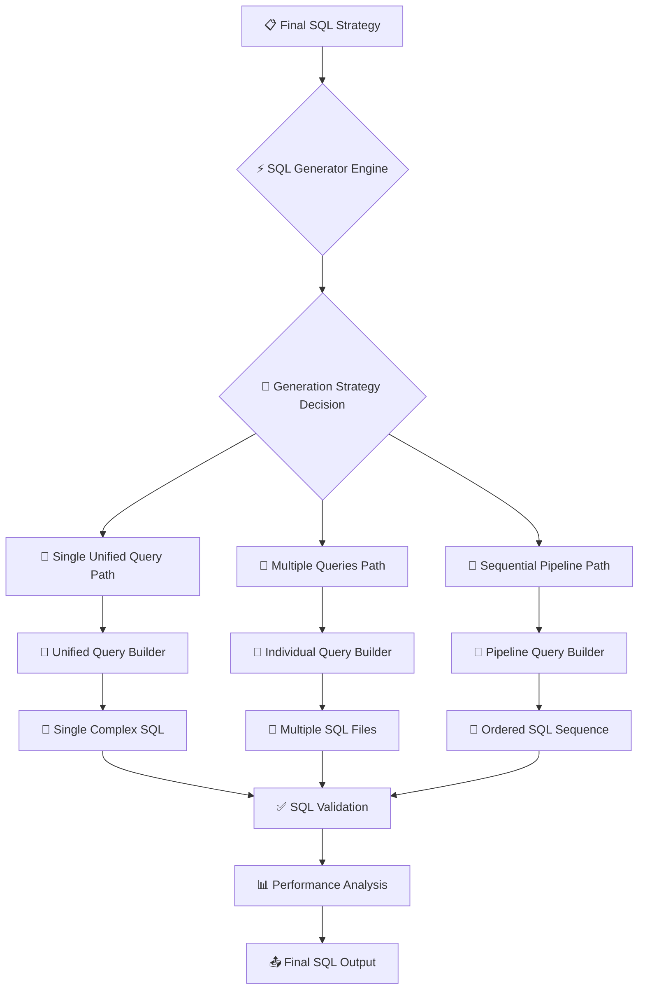
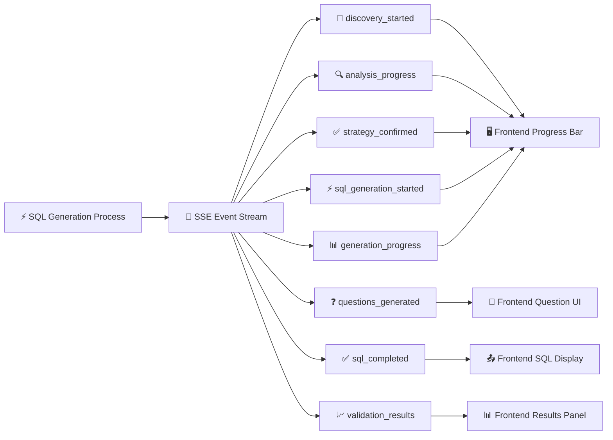

# 🔄 AI SQL Generation System - Data Flow Schema

## 📊 **Complete System Data Flow Diagram**



## 🏗️ **Detailed Component Architecture**

### **1. 📥 Input Processing Layer**



**Components:**

- **Excel Data Processor**: Handles any Excel structure
- **Sheet Parser**: Extracts sheet names, headers, row data
- **Content Extractor**: Pulls meaningful text from cells
- **Pattern Detector**: Identifies tables, lists, mappings
- **Consolidated Analysis**: Creates AI-analyzable text representation

### **2. 🧠 Information Discovery Layer**



### **3. 🤖 AI Strategic Analysis Layer**



### **4. ⚡ SQL Generation Layer**



### **5. 📡 Real-time Feedback Layer (SSE Events)**



## 🔄 **Complete System Flow Phases**

### **Phase 1: 📥 Input & Discovery**

```
Excel Upload → Content Analysis → Information Discovery Questions → User Guidance
```

### **Phase 2: 🧠 Strategic Analysis**

```
Information Mapping → AI Analysis → Strategic Questions → User Decisions
```

### **Phase 3: ⚡ SQL Generation**

```
Strategy Execution → SQL Building → Validation → Output Delivery
```

### **Phase 4: 📡 Real-time Feedback**

```
SSE Events → Frontend Updates → User Experience → Progress Tracking
```

## 📊 **Data Flow Example**

```json
{
  "input": {
    "excel_file": "sales_mapping.xlsx",
    "sheets": ["Instructions", "Field_Map", "Join_Logic", "Output_Format"],
    "user_context": "Need SQL for monthly sales report"
  },
  "discovery_phase": {
    "questions": [
      "Field_Map sheet has transformations - should I use column C for logic?",
      "Join_Logic has table relationships - are these complete?",
      "Output_Format shows target structure - is this the final format?"
    ],
    "user_responses": {
      "transformation_source": "Field_Map:Column C",
      "join_source": "Join_Logic:ERD section",
      "target_source": "Output_Format:Headers"
    }
  },
  "strategy_phase": {
    "analysis": {
      "target_tables": ["monthly_sales_summary"],
      "source_tables": ["orders", "customers", "products"],
      "complexity": "medium",
      "transformations": ["date_grouping", "sales_calculation"]
    },
    "strategic_questions": [
      "Single query or multiple steps?",
      "How to handle date grouping?",
      "Include all customers or filter?"
    ],
    "decisions": {
      "approach": "single_unified_query",
      "date_strategy": "monthly_grouping",
      "filter_strategy": "active_customers_only"
    }
  },
  "generation_phase": {
    "sql_output": "SELECT ... FROM orders o JOIN customers c ...",
    "validation": "passed",
    "performance_score": 85
  }
}
```

## 🎯 **Key System Benefits**

1. **🔍 Intelligent Discovery**: Automatically finds information in unstructured Excel
2. **💬 Strategic Guidance**: Asks smart questions to understand user intent
3. **🤖 Adaptive AI**: Handles any Excel structure with flexible processing
4. **⚡ Optimized Output**: Generates efficient SQL based on user strategy
5. **📡 Real-time Updates**: Provides live progress feedback via SSE
6. **🎯 User-Centric**: Focuses on business outcomes rather than technical details

This data flow ensures comprehensive, intelligent, and user-friendly SQL generation from any Excel mapping document! 🚀
